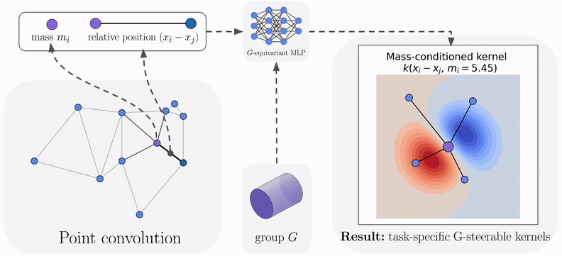

# [Implicit Convolutional Kernels for Steerable CNNs (NeurIPS 2023)](https://arxiv.org/abs/2212.06096)


**Authors:** Maksim Zhdanov, Nico Hoffmann, Gabriele Cesa

<ul>
<li>
<strong>Paper Link: </strong>
<a href="https://arxiv.org/abs/2212.06096">
    
</a>
</li>
<li>
<strong>Notebook demo:</strong>
<a href="https://github.com/maxxxzdn/implicit-steerable-kernels/blob/main/demo.ipynb">
    
</a>
</li>
<li>
<strong>Blog Post:</strong>
<a href="https://maxxxzdn.github.io/blog/implicit_kernels.html">
     
</a>
</li>
</ul>

## Abstract
Steerable convolutional neural networks (CNNs) provide a general framework for building neural networks equivariant to translations and other transformations belonging to an origin-preserving group $G$, such as reflections and rotations. They rely on standard convolutions with $G$-steerable kernels obtained by analytically solving the group-specific equivariance constraint imposed onto the kernel space. As the solution is tailored to a particular group $G$, the implementation of a kernel basis does not generalize to other symmetry transformations, which complicates the development of general group equivariant models. We propose using implicit neural representation via multi-layer perceptrons (MLPs) to parameterize $G$-steerable kernels. The resulting framework offers a simple and flexible way to implement Steerable CNNs and generalizes to any group $G$ for which a $G$-equivariant MLP can be built. We prove the effectiveness of our method on multiple tasks, including N-body simulations, point cloud classification and molecular property prediction.

## Requirements and Installation

- Python 3.8
- torch 1.10
- escnn 1.0.2
- pytorch-lightning 1.4.8
- torch-geometric 1.7.2

## Tutorial
Check `demo.ipynb` for an introduction to the implicit steerable kernels for point convolutions.

## Code Organization

- `datasets/`: Contains the data loading scripts.
- `models/`: Contains model and layer implementations.
- `models/core`: Contains implementation of implicit kernels in escnn.
- `scripts/`: Contains training scripts.
- `utils/`: Contains utility scripts.

## Citation
If you found this code useful, please cite our paper:
```
@inproceedings{
zhdanov2023implicit,
title={Implicit Convolutional Kernels for Steerable {CNN}s},
author={Zhdanov, Maksim and Hoffmann, Nico and Cesa, Gabriele},
booktitle={Thirty-seventh Conference on Neural Information Processing Systems},
year={2023},
url={https://openreview.net/forum?id=2YtdxqvdjX}
}
```